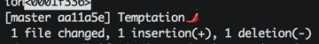

# SwiftNight presentation

This presentation was held on 20 April 2016 @iCapps

The presentation is best viewed with [decset](http://www.decksetapp.com) or [open the pdf](https://github.com/icapps/swiftNight_SwiftBeyondTheMac/blob/master/presentation.pdf).

# Credits
The swift language presentation is an interpretation (~ copy 🤔) of the presentation from @srbaker at [NSScotland 2014 vimeo](https://vimeo.com/search?q=nsscotland+2014). Or go directly to the original presentation [vimeo](https://vimeo.com/album/3132071/video/111942502). Thanks @srbaker!

# Talks
- Swift Language __[@stijn](https://twitter.com/doozMen) (30 min)__
- Using Playground's with Scripting __[@Jelle](https://twitter.com/fousa) (30 min)__
- Swift and Open Source __[@Hans](https://twitter.com/herre_84) (15 min)__
- Swift and Backend Development with [Vapor](https://github.com/qutheory/vapor) __[@Dylan](https://twitter.com/dylangyesbreghs) [@Hannes](https://twitter.com/VDBHannes) (20 min)__
  - This talk should had a topic from [@MoBinni](https://twitter.com/MoBinni) about [Kitura](https://github.com/IBM-Swift/Kitura) but due to time limitations all we got was a _Tempting_ screenshot
  
