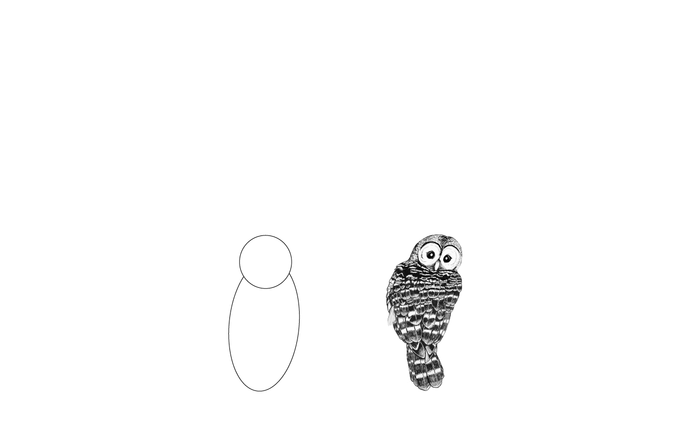
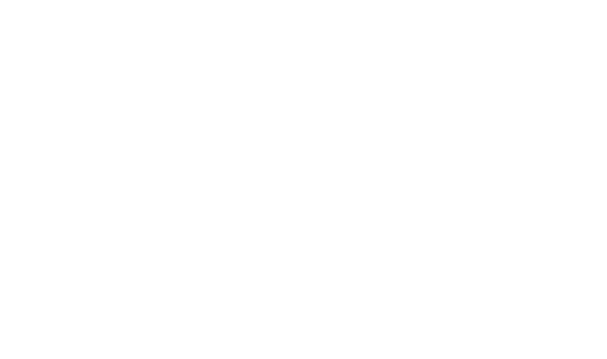
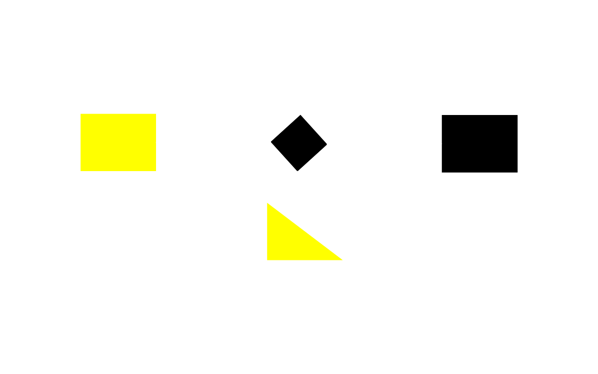
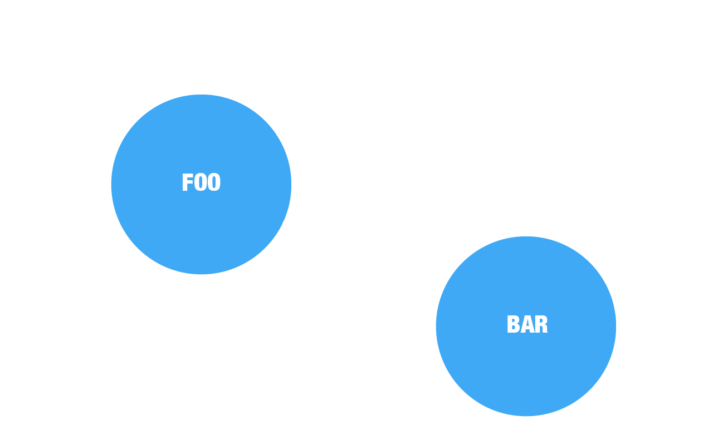
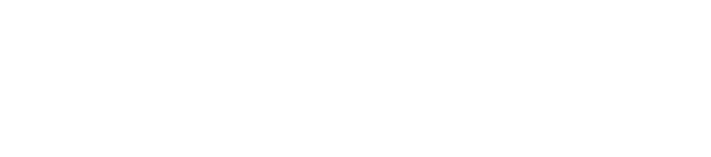
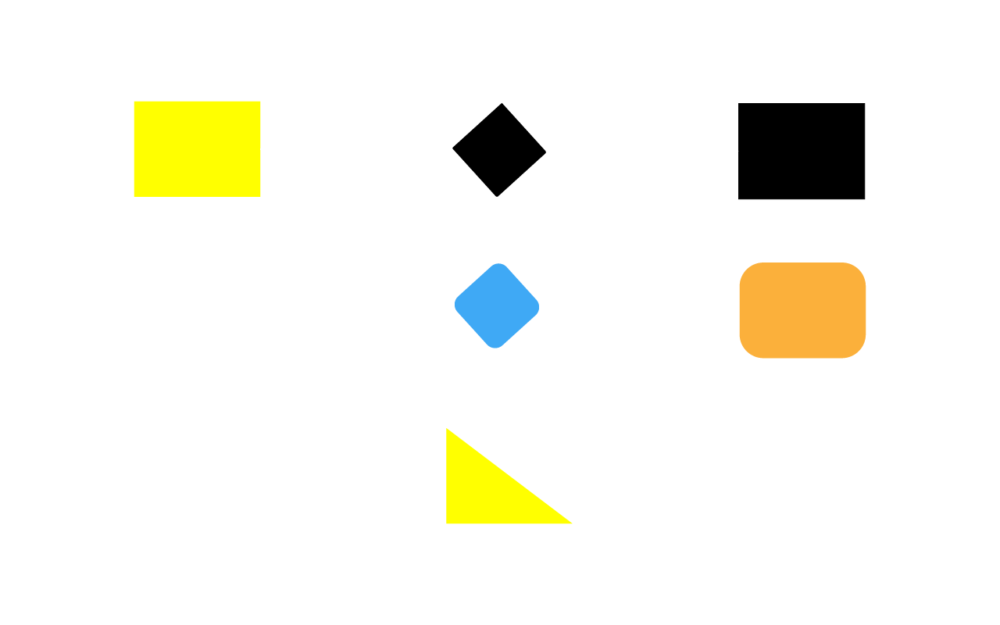
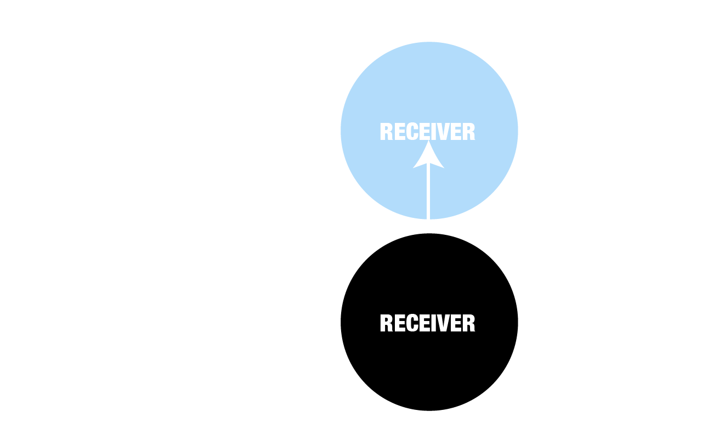
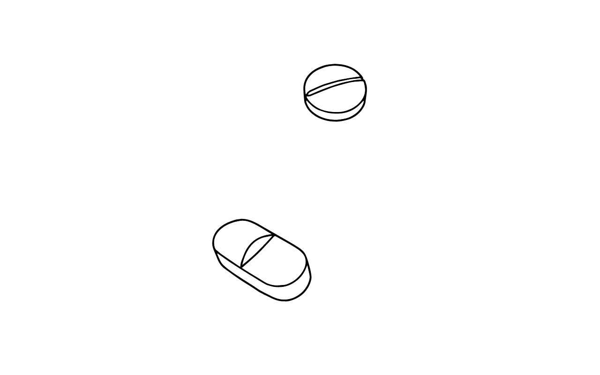
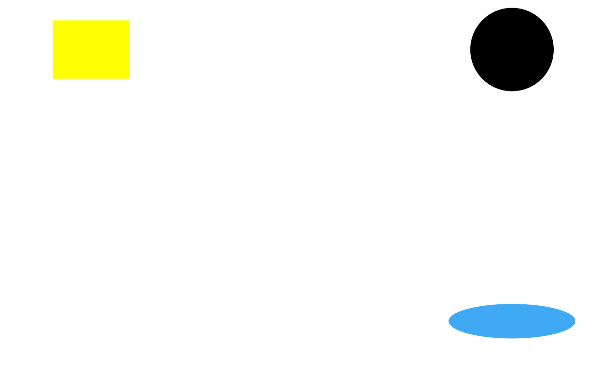

slidenumbers: true

# [fit] Bullshit you cannot draw



A look at the _swift language_ from a __drawing__ perspective

^ de Owl problem verteld dat je talen kan uitleggen zonder de nuances.
^ zonder nuances kan je een uil tekenen, maar ziet hij er dan uit als een uil?

^ Meestal als je vraagt om een probleem te tekenen in een blok schema merk je voor jezelf, of voor een ander dat je het nog niet zo goed begrijpt.
^ vandaar ook de header :)

---

 Based on _[a presentation](https://vimeo.com/album/3132071/video/111942502)_ of __@srbaker__ @NSConference 2014

^ Pragmatisch omgaan met Paradigmas
^ Een taal purist ben ik niet maar het is wel fijn om te weten waar je over praat. Als iemand anders dat goed doet, tja dan moet ik het wiel niet heruitvinden:)

---



^ Hoe een taal gebouwd -> Objective-C eerste taal grondig

^ Evident een array met verschillende Type's

^ Prototypes -> Producten

^ Dynamische bedacht om snel te veranderen

^ Deze presentatie

^ 4 tekening -> potentieel van Swift

^ Zo probeer ik het toch te bevatten :)

---





^ Tekeningen ->
^ Procedural
^ Object Oriented - OO
^ Functional

---


Procedural / Object Oriented - __OO__ / Functional

- Type sytems


^ Uiteindelijke moeten ze allemaal met types omgaan.
^ Welk pad je ook kiest!

---

> As goes with paths, they thend to mix. But they where __never intended__ to do so...
-- @srbaker

---


# Grow the system

^ Elk programma moet uitgebried worden. Elk path dat we bespraken heeft zijn tactiek om dat te doen.

^Taal als enige bouwsteen.

^ Want hoe moelijk we er ook over doen een taal stuurt meestal een ledje aan.

---

_Bind `Code` to `hardware` => Type_

What is Type?

^ Wat doen als het veel ledjes worden.

---


^In het begin, C, -> Anything that has the same length is a type
^ Ledjes moeten letters kunnen weergeven
^ Heeldere objecten opslaan ...

---

More later ...

Lets __juggle__ some types around...

---



---


## Procedural

> Data __(Type)__ moves and Changes

---


^Dit zit er wat uit als een flow diagram en dat is het eigenlijk ook.

---

# Grow?


---



^ De flow kan veranderen
^ De data kan veranderen

---
Many _OO_ programming is actually __procedural__
-- @srbaker

---
# Examples of pure procedural

C / Go / Fortran / Pascal

^Objective-C is gebouw in C
^ Trots dat Swift gebouwd is zonder de C

---
# OO

---


---


Messaging

---


> __OO__ Makes code understandable by __incapsulating__ the moving parts.
-- Micheal Feathers

---


---


Smalltalk /  Ruby

^ Pure OO talen

---

Objective-C / Python

^ OO but

---
## Messaging?

^Maar we gingen het hebben over hoe we zo een syteem konden doen groeien

^ OO systemen zijn per definitie dynamisch.
^ Alan Key -> OO is bedoeld om dynamisch te zijn.
^ Beslis pas als het moet...

---


^messaging tussen request en ontvanger zit een queue.

^Deze queue maakt dat OO talen snel kunnen veranderen
^ Ruby doet dit omdat ze continu willen kunnen updaten zonder dat server down gaat.
^ Objective-C -> Steve Jobs rekenmachine met andere kleuren die at run time ingesteld kunnen worden.

---

## Grow?


---


^Het doel van messaging is los gekoppelde Objecten te hebben.
^At runtime kunnen deze veranderen en de queue spaart de berichten op tot de verandering klaar is.

---
# So What?

```swift
class Foo {
  let webService = Service ()

  func do (completion: ()->()) {
    webService.do {
      //code async
      completion()
    }
  }
}

// write unit test

class FooTests {
  func testFoo () {
    let foo = Foo()
    foo.do {
      Assert ...
      //This will be async
    }
  }
}
```

^Er is at run time geen mogelelijkheid om do synchroon te maken in swift
^ Als je message queue hebt dan kan dat wel ...

---
# Functional

---


^ Geen is no encapsulation.
^ Data kan en mag niet veranderen.
^ Het is heel rechtlijnig en eenvoudig.
^ Het concept toch

---
# ?


^ voor mij functioneel toch vooral een misterie in gebruik

---


> __FP__ Makes code understandable by __minimizing__ the moving parts.
-- Micheal Feathers

---


> OO -> incapsulating
> FP -> minimizing

__Moving parts__

-- Micheal Feathers

---
## Grow ?


^ Lineair groeien
^ We kunnen de pillen niet open doen, een methode toevoegen
^ Code hergebruiken is hier minder eenduidig voor mij

---




^ Ziet er op zich eenvoudig uit

---


## [Fit] IMMUTABLE

~~side effects~~

^ Belang uitleggen vanuit een animerende view.

---

# Recap


^Alles klinkt nu waarschijnlijk gelijk
^ wat doet het er toe dit te weten.
^ Hoe verandert het mijn code
^ Misschien wat heeft het te maken met Swift?

---


^Hier ontbreekt wel een deel
^ Type system
^ Swift gebruikt de patronen waar en wanner dit zinvol is.

---
# [fit] Type system


---


^ Goal
^ Code reuse
^ Safety
^ Possible speed improvements

^ Swift is strongly typed en static
^ even uitleggen wat dat betekend

---

```
            Java                                  Ruby
            C                                     Smalltalk
static ------------------------------------------------------ Dynamic
```

^ Discussie kan je niet ontwijken
^ Maar hopelijk gaat ze verder dan dat
^ Unit test voorbeeld verwijzen naar static typing

---
## Checking

```
            compile time                            Run time
static ------------------------------------------------------ Dynamic
```
^ static -> Type checking done at compile time
^ Dynamic -> type checking done at run time
^ Type safe betekend eigenlijk memory safe.

### Static
```swift
var i = 1
i = "One" // Error
```

---
### Dynamic

Class instantiation can be __data driven__

```objectivec


NSString *className = [self getClassNameFromJSON];


//This can only be checked at run time. The JSON file might change.
A* a = [[NSClassFromString(className) alloc] init];
```

---

## Type inference

```swift

 var s = "A string"
 var s2:String
 s2 = "Another string"


```

[More info](http://books.aidanf.net/learn-swift/types_and_type_inference)

^Je krijgt static typing for free
^Enkel in de functie namen moet je een Type melden. De rest wordt afgeleid. Je krijgt static typing dus ongeveer vanzelf.

---


^ Strong betekend gewoon dat je type altijd gecheckt wordt.
^ Een taal die Strong is wil soms ook static worden -> Duby

---

# Messaging in swift


Not yet, or might __never__ be ...

[More info](http://www.buckleyisms.com/home/2014/6/16/the-case-for-message-passing-in-swift.html)

---

> Swift is an impure language that is build __intentionaly__ that way.
-- Anonymous

---
__.Net to swift__ -> will there be anything else?


